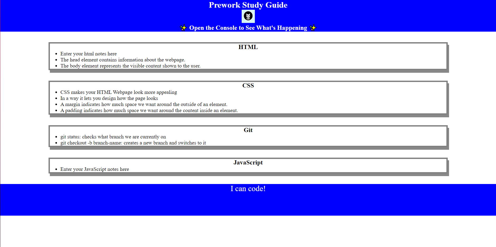

# Prework Study Guide Webpage

## Description

I built this project to help me refresh and improve my coding skills. It helped me remember a lot of basic coding skills I had forgotten. I learned that even if I know the content does not mean I cannot pick up a new skill from it.

## Installation

Tools needed for the installation:
Git Bash
Github
Visual Studio Code

Firstly start with creating a GitHub and a repostory afterwards you want to link it to your Git bash. Next Link your Visual Studio Code to the Gitbash. Moving forward you will be able to set everything up within Git Bash such as creating HTML, CSS, and JS files. Git bash will be communicating to both tools making updating everything simple. But you will need to confirm the updates on GitHub for the code to be on the main.

Coding languages:
HTML
CSS
JavaScript

I started by building up the base of the Study guide With HTML. Afterward, I used CSS to make the website appealing and look nice. Lastly, I added JavaScript code to add additional information to the console.

## Usage

The Purpose of the study guide is to help with a basic understanding of HTML CSS, JavaScript, and Git. Underneath each section, it provides information on the topic. For example, If I wanted to know what a variable is I would go to the JavaScript section and it tells me that "A variable is a named container that allows us to store data in our code".

## Credits
https://bootcampspot.instructure.com/courses/4682/pages/3-dot-1-3-review-how-html-structures-a-webpage?module_item_id=995176

https://bootcampspot.instructure.com/courses/4682/pages/3-dot-1-4-describe-the-body-of-an-html-document?module_item_id=995178

https://bootcampspot.instructure.com/courses/4682/pages/3-dot-1-5-set-up-html-section-and-child-elements?module_item_id=995180

https://bootcampspot.instructure.com/courses/4682/pages/3-dot-1-6-complete-the-git-flow?module_item_id=995182

https://bootcampspot.instructure.com/courses/4682/pages/3-dot-2-3-create-the-css-file?module_item_id=995193

https://bootcampspot.instructure.com/courses/4682/pages/3-dot-2-5-add-style-using-class-attributes?module_item_id=995197

https://bootcampspot.instructure.com/courses/4682/pages/3-dot-3-3-add-a-variable-to-a-javascript-file?module_item_id=995211

https://bootcampspot.instructure.com/courses/4682/pages/3-dot-3-4-add-conditional-logic-using-javascript?module_item_id=995213

https://bootcampspot.instructure.com/courses/4682/pages/3-dot-3-5-incorporate-arrays-and-for-loops?module_item_id=995215

https://bootcampspot.instructure.com/courses/4682/pages/3-dot-4-3-write-a-function?module_item_id=995229

https://bootcampspot.instructure.com/courses/4682/pages/3-dot-4-4-call-a-function?module_item_id=995231

## License

MIT License

Copyright (c) 2023 Unevailable

Permission is hereby granted, free of charge, to any person obtaining a copy
of this software and associated documentation files (the "Software"), to deal
in the Software without restriction, including without limitation the rights
to use, copy, modify, merge, publish, distribute, sublicense, and/or sell
copies of the Software, and to permit persons to whom the Software is
furnished to do so, subject to the following conditions:

The above copyright notice and this permission notice shall be included in all
copies or substantial portions of the Software.

THE SOFTWARE IS PROVIDED "AS IS", WITHOUT WARRANTY OF ANY KIND, EXPRESS OR
IMPLIED, INCLUDING BUT NOT LIMITED TO THE WARRANTIES OF MERCHANTABILITY,
FITNESS FOR A PARTICULAR PURPOSE AND NONINFRINGEMENT. IN NO EVENT SHALL THE
AUTHORS OR COPYRIGHT HOLDERS BE LIABLE FOR ANY CLAIM, DAMAGES OR OTHER
LIABILITY, WHETHER IN AN ACTION OF CONTRACT, TORT OR OTHERWISE, ARISING FROM,
OUT OF OR IN CONNECTION WITH THE SOFTWARE OR THE USE OR OTHER DEALINGS IN THE
SOFTWARE.

